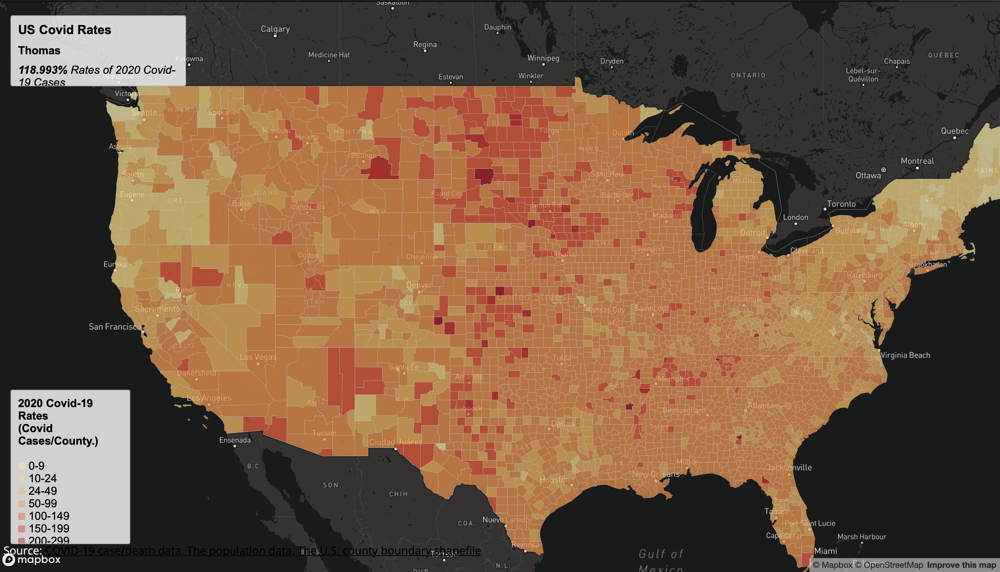

# Covid-19 Thematic Maps
##### This project is a part of a GIS course assignment to create two thematic maps of COVID-19 cases and rates in the United States. The data used in this project are based on the COVID-19 case/death data from The New York Times and the population data from the 2018 ACS 5 year estimates, both at the county level. The U.S. county boundary shapefile was downloaded from the U.S. Census Bureau.

> This is image that is outputted from Map 1.

> This is image that is outputted from Map 2.

### Project Description
##### The project consists of two maps, a choropleth map of the COVID-19 rates and a proportional symbols map of COVID-19 cases. The choropleth map is compiled in the map1.html page and the proportional symbols map is in map2.html. The maps use the Albers projection and an appropriate zoom level and map center has been applied. An appropriate basemap has been chosen for each map, and a fully-functioning thematic layer for each map is also included. Legends for each map have been added, as well as some interactive elements such as a clickable dot. The maps also include supplementary information such as the map title, map description, data sources, and credit.

### Data Processing
##### The shapefiles have been converted to geojson data and the projection, unused attributes, and geometric shapes have been simplified from 100% to 60%. The case rate has been calculated as cases per thousand residents.

### Data Sources
##### The data used in this project are originally from The New York Times and the U.S. Census Bureau. The data have been processed to suit the purpose of this lab.

### Credits
##### This project was completed as a part of a GIS course assignment. The data processing and map creation were done by the author.

### Note
##### The data used in this project is based on the COVID-19 case/death data from The New York Times and the population data from the 2018 ACS 5 year estimates, both at the county level. The data may not be up to date and should not be used for official purposes.
